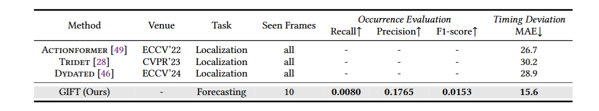

# SHOT Dataset
This repository contains the official introduction and codes implementation for paper **"Beyond the Individual: Introducing Group Intention Forecasting with SHOT Dataset"**.

[Paper](to-be-updated) ⋅ [WebPage](https://xinyi-hu.github.io/SHOT_DATASET/) ⋅ [Dataset](to-be-updated)

## News
[2025.06] Our project webpage is released.

## Requirements
To be updated...

## SHOT Dataset
SHOT is the first large-scale dataset for Group Intention Forecasting (GIF), consisting of 1,979 basketball video clips captured from 5 camera views and annotated with 6 types of individual attributes. The dataset is designed with 3 key characteristics: **multi-individual information**, **multi-view adaptability**, and **multi-level intention**.

The basic structure is shown as following, with more details of implementation to be updated...

## Dataset Pipeline
To be updated...

## Method: GIFT Framework
GIFT (Group Intention ForecasTer) is a framework that extracts fine-grained individual features and models evolving group dynamics to forecast intention emergence.

## Results
To be updated...

## Citation
If you use this code and data for your research or project, please cite (to be updated...):
